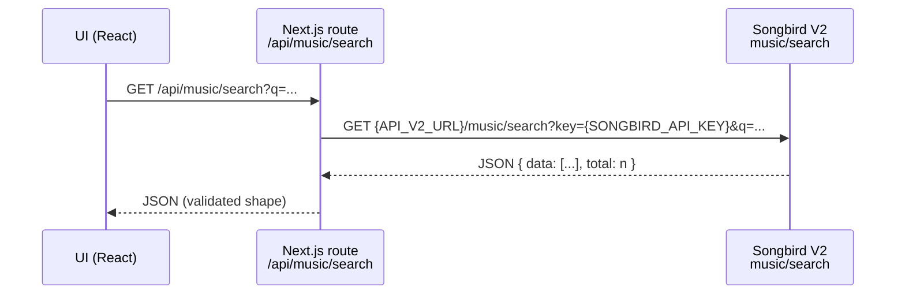
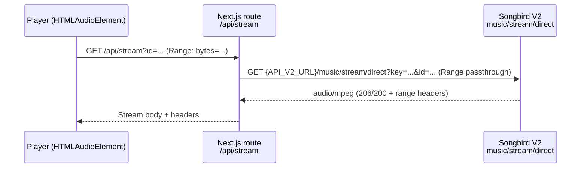
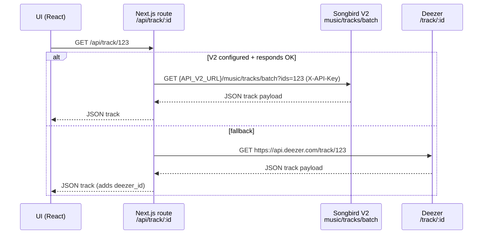

# Architecture

Starchild Music (songbird-player) is a **Next.js App Router** application that runs as:

- **Web** app (Next.js server)
- **Desktop** app (Electron wrapper that loads the Next.js server)

It combines a local backend (tRPC + Postgres via Drizzle) with proxy routes that integrate external music APIs (Songbird V2 and Deezer).

## High-level component view

```mermaid
flowchart LR
  User[User] --> UI[Next.js App Router UI<br/>src/app]

  UI --> TRPC[tRPC client<br/>src/trpc]
  TRPC --> TRPCEndpoint[/api/trpc<br/>src/app/api/trpc/[trpc]/route.ts]
  TRPCEndpoint --> Routers[tRPC routers<br/>src/server/api/routers]
  Routers --> DB[Postgres via Drizzle/pg<br/>src/server/db]

  UI --> Proxy[/api/* proxy routes<br/>src/app/api/**/route.ts(x)]
  Proxy --> Songbird[Songbird V2 API<br/>API_V2_URL + SONGBIRD_API_KEY]
  Proxy --> Deezer[Deezer API<br/>api.deezer.com]

  UI --> Auth[/api/auth/* (NextAuth)<br/>src/app/api/auth/[...nextauth]/route.ts]
  Auth --> Discord[Discord OAuth]
  Auth --> DB

  subgraph Desktop[Electron]
    ElectronMain[electron/main.cjs] --> UI
  end
```

## Runtime entrypoints

### Dev / prod server

- Primary entry: `scripts/server.js`
  - Dev: `npm run dev` → `node scripts/server.js` → `next dev --turbo`
  - Prod: `npm run start` → `node scripts/server.js` → `next start`
  - Default port: `3222` (via `PORT`)

### Next.js surfaces

- App Router UI: `src/app/**`
- API routes:
  - tRPC: `src/app/api/trpc/[trpc]/route.ts`
  - External proxy routes (Songbird/Deezer): `src/app/api/**/route.ts(x)`
  - Health: `src/app/api/health/route.ts`
  - Auth: `src/app/api/auth/[...nextauth]/route.ts`

## Data and control flows

### Search flow (V2-only)

`/api/music/search` is a proxy route that calls Songbird V2 directly and returns a Deezer-shaped payload.



### Streaming flow (V2-only)

`/api/stream` proxies audio from Songbird V2 and preserves `Range` semantics for seeking.



### Track metadata flow (V2 preferred, Deezer fallback)

`/api/track/[id]` tries Songbird V2 batch metadata first, then falls back to Deezer if V2 is unavailable or fails.



### Auth flow (Discord OAuth via NextAuth)

- Auth handlers: `src/server/auth/*` and `src/app/api/auth/[...nextauth]/route.ts`
- Persistent session/user data: Postgres (Drizzle migrations in `drizzle/`)

## Persistence layer

- DB client: `src/server/db/index.ts` (`pg` `Pool` + `drizzle-orm`)
- DB schema: `src/server/db/schema.ts`
- Migrations: `drizzle/*.sql`

Notes:

- Runtime code expects `DATABASE_URL` to be set (it throws otherwise).
- SSL is enabled automatically for non-local `DATABASE_URL` values.

## Player subsystem (client-side)

Primary pieces:

- Context/state: `src/contexts/AudioPlayerContext.tsx`
- Core behavior: `src/hooks/useAudioPlayer.ts`
- Recommendations / smart queue: `src/services/smartQueue.ts`
- Visualizers: `src/components/visualizers/*`

The player uses **HTML5 Audio** for playback and **Web Audio API** for equalizer/analysis.

## Desktop (Electron)

- Main process: `electron/main.cjs`
- Preload: `electron/preload.cjs`
- Packaging: `electron-builder` config in `package.json` and helper scripts under `electron/` and `scripts/`

In development, Electron runs alongside the dev server (`npm run electron:dev`) and loads `http://localhost:3222`.

## Deployment shapes

- Local dev: `npm run dev` (custom server wrapper; `.env` only in dev)
- Docker: `docker-compose.yml` + `Dockerfile` (build args mirror `src/env.js`)
- Process manager: PM2 (`ecosystem.config.cjs`)
- Vercel: `vercel.json` (DB pool tuned for Vercel is handled in `src/server/db/index.ts`)

## Related docs

- `docs/API_ROUTE_USE.md` (route-by-route backend mapping)
- `docs/API_USE.md` (external APIs + required environment variables)
- `docs/API_V2_SWAGGER.yaml` (upstream OpenAPI spec for the service configured as `API_V2_URL`)
